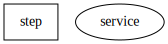
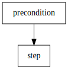
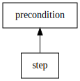
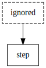
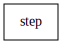

# Examples

Gantry supports `services` (oval shapes) and `steps` (box shapes).

Services and steps can have lines to their dependents. `precondition` is
executed before `step`.

The direction of the arrows can be reversed using `--arrow-to-precondition` to
point to each precondition.

If a shape is dashed it is marked to be ignored. Using `--hide-ignored` can
be used to exclude them completely.

## Using `gantry dot` to generate images

All images in the example folders are generated using `gantry dot` which takes
the same arguments as `gantry up` and the [dot](https://graphviz.gitlab.io/download/)
rendering tool.

    gantry dot [args...]
    dot -Tsvg -o <filename> gantry.dot

The images above can be recreated using:

    gantry dot -f types.yml --output types.dot
    dot -T svg -o types.svg types.dot
    gantry dot -f simple.yml --output simple.dot
    dot -T svg -o simple.svg simple.dot
    gantry dot -f simple.yml --output simple_arrow_to_precondition.dot --arrow-to-precondition
    dot -T svg -o simple_arrow_to_precondition.svg simple_arrow_to_precondition.dot
    gantry dot -f ignored.yml --output ignored.dot -i ignored
    dot -T svg -o ignored.svg ignored.dot
    gantry dot -f ignored.yml --output ignored_hidden.dot -i ignored --hide-ignored
    dot -T svg -o ignored_hidden.svg ignored_hidden.dot

This stores each `.dot` file separately. If `--output` is not provided
`gantry.dot` will be used to store the data.
