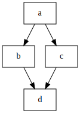

# Diamond dependencies

  * [gantry.def.yml](./gantry.def.yml)

Using `after` to describe dependencies allows for parallel exectution of `b`
and `c` as indicated by the structure. Step `d` is executed as soon as both
`b` and `c` are finished.
