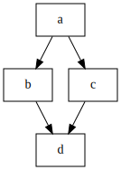

# Diamond dependencies with specific exit codes

* [gantry.def.yml](./gantry.def.yml)
* [gantry.env.yml](./gantry.env.yml)



The steps `b`, `c`, and `d` are set up to always exit with an error code
`!= 0` indicating an error.

For steps `b` and `d` the exit code from the step is forwarded without any
changes. However, for step `c` the exit code is always set to `2` using the
override functionality in `gantry.env.yml`.

```
$ gantry -i c
$ $?
1

$ gantry -i b
$ $?
2

$ gantry -i b -c
$ $?
3
```
