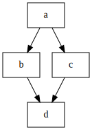

# Diamond dependencies with ignore failure

  * [gantry.def.yml](./gantry.def.yml)
  * [gantry.env.yml](./gantry.env.yml)

Step `b` is set up to always exit with an error code of `1` marking the step
as failed but using `ignore_failure` in `gantry.env.yml` allows the pipeline
to continue execution. This is usefull if a step has to perform a non-vital
action before the end of the pipeline without ignoring the step completely.
