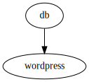

# Using docker-compose.yml

This is a slightly modified
[docker-compose example](https://docs.docker.com/compose/wordpress/) as
`docker-compose` supports different markup for environment variables and named
volumes are not (yet) implemented into `gantry`.

## Running using docker-compose
    docker-compose up
This creates a default network, starts both containers, and attaches to them.
For the same behaviour gantry provide the `-d` flag to detache from the
containers.

To clean up stop the deployment using `docker-compose down`.

## Running using gantry
    gantry up
This creates a default network and starts both containers detached. To clean up
`gantry down` is used. The `up` command can be omitted from gantry to simplify
running deployments.
