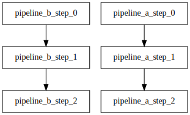

# Parallel pipelines

  * [gantry.yml](./gantry.yml)

Multiple pipelines in the *same* `gantry.yml` will be executed in
parallel. Usage of this feature is **not** advised unless these pipelines
**must always** be executed together.

Deterministic execution of steps is only guaranteed inside each pipeline.
