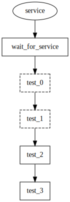
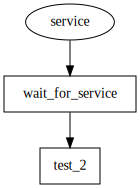

# Partial execution

  * [gantry.yml](./gantry.yml)
  * [gantry.env.yml](./gantry.env.yml)

When run without arguments the example starts a `service`, waits for its
availability and then executes a number of tests which are sequenced but
independent.

## Ignore `test_1` and `test_0`

To ignore `test_1` and `test_0` the following command should be used:

    gantry -i test_0 -i test_1

## Start service and only run `test_2`

To only run `test_2` after the service is ready the steps `test_0`, `test_1`,
and `test_3` have to be ignored, this can be achieved with:

    gantry -i test_0 -i test_1 -i test_3

To reduce the number of explicitly ignored steps while making sure that none
are falsely executed, the same can be achieved using:

    gantry -i test_1 wait_for_service test_2

This works as only the explicitly selected steps and their dependencies are
executed unless these dependencies are explicitly ignored using `-i`.
In this example `test_3` is ignored because of the specific selection of
`test_2`. `test_1` is explicitly marked as ignored and `test_0` is ignored
because it is only a dependency for the ignored `test_1`. If
`wait_for_service` was not explicitly selected it would be ignored too, but as
it is selected `wait_for_service` and the dependency `service` are executed.
