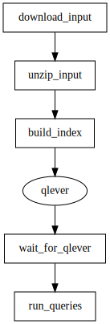

# Testing QLever using gantry.def.yml and gantry.env.yml

  * [gantry.def.yml](./gantry.def.yml)
  * [gantry.env.yml](./gantry.env.yml)

This example runs the End-to-End tests of
[QLever](https://github.com/ad-freiburg/QLever). It's an adaptation of the
[shell script](https://github.com/ad-freiburg/QLever/blob/b728ddd0f3ac3e4c9d1f0e92426f5b592a4f141f/e2e/e2e.sh)
using multiple steps and starting a service (qlever).

The pipeline downloads and prepares the data to create an index for qlever.
After the qlever service is started some basic queries are perfomed against
the newly build index. After the pipeline finishes the temporay download
directory is automatically cleaned up as the `TempDir` function is used in
[gantry.def.yml](./gantry.def.yml) and the service is stopped as
`keep_alive: "no"` is set for the `qlever` service in
[gantry.env.yml](./gantry.env.yml).
