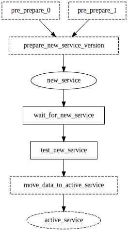

# Selective run

  * [gantry.yml](./gantry.yml)
  * [gantry.env.yml](./gantry.env.yml)

This example demonstrates how an active service could be updated with minimal
downtime and test of a new version using the `-i` command and explicit
step/service selection.

## Running tests without preparing a new version

 

    gantry -i prepare_new_service_version test_new_service

This forces gantry to ignore all non-dependencies of
`test_new_service`. `prepare_new_service_version` is explicitly ignored thus
`pre_prepare_0` and `pre_prepare_1` are not considered dependencies for
`test_new_service` and are ignored.
